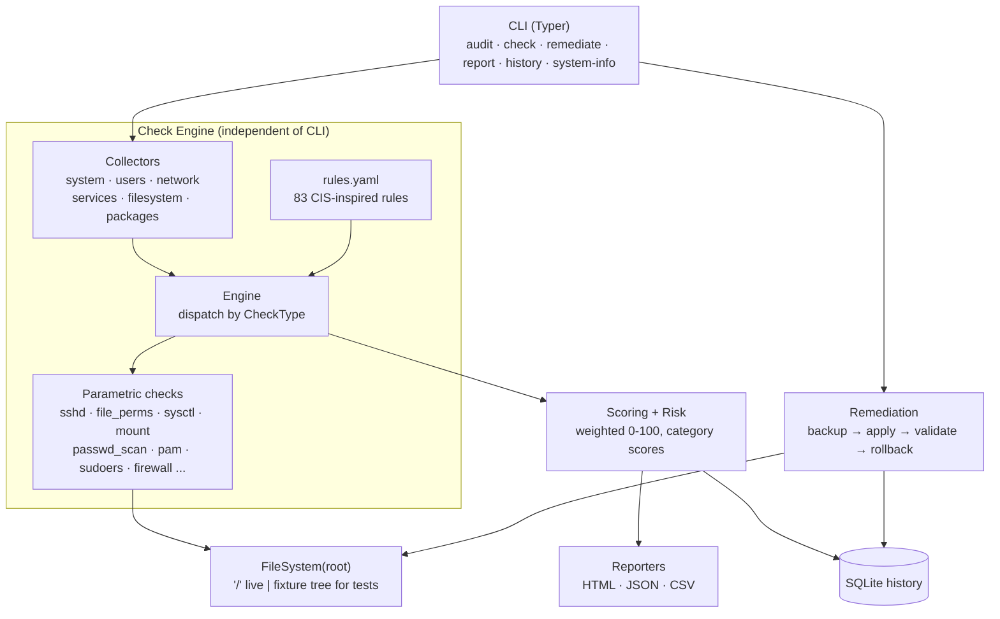

# Linux CIS Hardening Auditor

> A defensive, **audit-only-by-default** Linux security assessment tool that evaluates a system against **CIS-inspired** hardening controls, scores compliance, produces professional reports, and offers *safe* remediation with automatic backups and rollback.

[](https://github.com/USER/linux-cis-hardening-auditor/actions/workflows/ci.yml)


---

## ⚠️ Scope, ethics & CIS wording

- This is a **defensive security / system-hardening** tool. It contains **no offensive functionality**.
- Use it **only** on systems you **own or are explicitly authorized** to assess.
- The **default mode is strictly read-only**. Nothing on the host is modified unless you explicitly run `remediate` and confirm.
- This project implements **CIS-aligned / CIS-inspired** auditing logic. It is **not** an official CIS Benchmark and passing its checks does **not** constitute "CIS compliance." Exact benchmark section numbers are intentionally not claimed. **Applicability of any specific control depends on your Linux distribution and version** — validate against the official CIS Benchmark for your OS.
- *CIS® and CIS Benchmarks™ are trademarks of the Center for Internet Security. This project is independent and not affiliated with or endorsed by CIS.*

---

## Features

- **83 meaningful, CIS-inspired checks** across 11 categories (SSH, authentication, users/groups, filesystem, network, firewall, kernel/sysctl, services, logging/audit, sudo, cron).
- **Modular rule engine** — rules live in `checks/rules.yaml`; reusable, unit-tested check implementations in Python. The engine is fully decoupled from the CLI.
- **Weighted compliance score** (0–100) plus **per-category scores**, with a documented methodology.
- **Prioritized remediation plan** ranked by severity and status.
- **Professional reports** in **HTML** (assessment-report styled), **JSON** (machine-readable) and **CSV**.
- **SQLite history** so you can track posture over time.
- **Safe remediation** behind a `--fix`-style flow: dry-run preview → backup → apply → validate → **rollback on failure**. Critical services are **never** auto-restarted.
- **Multi-distro architecture** (primary: Ubuntu 22.04 / 24.04) with honest `NOT_APPLICABLE` handling for un-validated distros.
- **Deterministic fixture engine** — the exact same check code runs against a temp "system tree," so the whole suite is testable without root and without touching the host.
- **Security-first implementation** — no `shell=True`, an executable allow-list, argument-vector subprocess calls, path-traversal guards, and secret redaction in logs.

---

## Architecture



The key abstraction is `FileSystem(root)`: every check reads configuration relative to a configurable root. On a live host the root is `/`; in tests and demos it points at a generated fixture tree, so **the same check logic** is exercised deterministically with zero risk to the host.

```
linux-cis-hardening-auditor/
├── app/
│   ├── cli/            # Typer CLI + rich rendering
│   ├── collectors/     # system discovery (audit metadata)
│   ├── checks/         # rule engine + parametric check implementations
│   ├── remediation/    # safe apply/backup/validate/rollback
│   ├── models/         # pydantic models + enums
│   ├── database/       # SQLite history
│   ├── reporting/      # scoring, risk, JSON/CSV/HTML reporters
│   ├── config/         # settings loader (yaml.safe_load only)
│   └── utils/          # safe command runner, rooted filesystem, logging
├── checks/rules.yaml   # rule definitions (data, not code)
├── templates/report.html
├── tests/ + tests/fixture_builder.py
├── scripts/demo.py
├── docs/               # architecture, rules, scoring, remediation, usage
├── Dockerfile · docker-compose.yml · pyproject.toml
```

See [`docs/architecture.md`](docs/architecture.md) for a deeper tour.

---

## Supported platforms

| Distribution | Status |
|---|---|
| Ubuntu 24.04 / 22.04 LTS | **Implemented & tested** (primary) |
| Debian 12+ | **Supported** — same `debian` family (shared `apt`/`dpkg`, config layout, `sudo` group, sysctl/mount semantics) |
| Kali Linux | **Supported** — `debian` family; some controls (e.g. IP forwarding, no host firewall) are expected on a pentest box — judge findings in context |
| Raspberry Pi OS / Linux Mint / Pop!_OS / … | **Supported** — `debian` family |
| Rocky / AlmaLinux / RHEL / Fedora | Architecture-ready — RPM collector path present; `rhel`-family rules not yet validated → `NOT_APPLICABLE` |

Rules bind to a distribution **family** (`app/models/distro.py`), not a single ID: a control validated on Ubuntu applies unchanged across the Debian family. The tool **detects** distribution, version, kernel, architecture, hostname and uptime, and **never pretends** a check is supported on a family it has not been validated against — unvalidated families report `NOT_APPLICABLE` rather than a guessed result.

---

## Installation

Requires **Python 3.11+**.

```bash
git clone https://github.com/USER/linux-cis-hardening-auditor.git
cd linux-cis-hardening-auditor

python -m venv .venv && source .venv/bin/activate
pip install -e ".[dev]"       # or: pip install -e .
```

---

## Usage

The tool is invoked as `python -m app` (or the `cis-auditor` entry point after install).

```bash
# Full audit of the local system (READ-ONLY)
python -m app audit

# Audit just one category
python -m app audit --category ssh
python -m app audit --category filesystem

# Only high-signal quick checks
python -m app audit --quick

# Only rules of a given severity
python -m app audit --severity high

# Evaluate a single control with full evidence
python -m app check --rule SSH-001

# Machine-readable / report files
python -m app audit --format json  -o report.json
python -m app audit --format csv   -o report.csv
python -m app audit --format html  -o report.html
python -m app report                       # full HTML report (default)

# Discovery, catalog and history
python -m app system-info
python -m app list-rules --category sudo
python -m app history

# Try it safely against a generated demo system (no host access):
python scripts/demo.py                      # writes reports/demo/*.{html,json,csv}
python -m app audit --root /tmp/demo-secure # audit any fixture/chroot-like tree
```

### Audit modes

| Mode | Command |
|---|---|
| Full audit | `python -m app audit` |
| Category audit | `python -m app audit --category ssh` |
| Single rule | `python -m app check --rule AUTH-001` |
| Quick audit | `python -m app audit --quick` |

The `audit` command exits `2` when any **HIGH/CRITICAL** control fails — convenient for CI gating — and `0` otherwise. It **never** modifies the system.

---

## Rule system

Rules are **data**, not code. Each rule in `checks/rules.yaml` binds to a reusable, tested check implementation via `check.type`:

```yaml
- rule_id: SSH-001
  title: Disable direct SSH root login
  category: ssh
  severity: HIGH
  benchmark_reference: "CIS-inspired: SSH Server Configuration (PermitRootLogin)"
  description: "SSH should not permit direct interactive login as root."
  rationale: "Direct root login removes per-user accountability..."
  expected: { PermitRootLogin: "no" }
  check:
    type: sshd_config
    params: { option: PermitRootLogin, op: equals, expected: "no", default: "prohibit-password" }
  remediation:
    supported: true
    requires_confirmation: true
    restart_service: ssh
    action: { kind: sshd_option, option: PermitRootLogin, value: "no" }
```

Adding a rule for an existing check type is a **YAML-only change** — no Python required. See [`docs/rules.md`](docs/rules.md) for the full catalog and the list of check types.

---

## Severity & scoring

Severities are **calibrated per rule** — not everything is HIGH:

`CRITICAL` · `HIGH` · `MEDIUM` · `LOW` · `INFO`

**Score (0–100)** is severity-weighted. Only `PASS`/`FAIL`/`WARN` participate; `NOT_APPLICABLE` and `ERROR` are excluded from both sides of the ratio. A `WARN` earns partial credit (half by default).

```
weight: CRITICAL=10, HIGH=6, MEDIUM=3, LOW=1, INFO=0
earned      = Σ weight(PASS) + 0.5 · Σ weight(WARN)
achievable  = Σ weight(PASS, FAIL, WARN)
score       = round(100 · earned / achievable)
```

Full details and worked examples in [`docs/scoring.md`](docs/scoring.md).

---

## Safe remediation

Remediation is **opt-in per invocation** and **per rule** (many controls are deliberately manual-only, e.g. disabling SSH password auth, which could lock out remote users).

```bash
# 1) Preview only — never changes anything
python -m app remediate --rule SSH-001 --dry-run

#   DRY RUN  SSH-001  (sshd_option)
#   Before:  PermitRootLogin yes
#   After:   PermitRootLogin no
#   DRY RUN -- no changes were made.

# 2) Apply — prompts for confirmation, creates a backup, validates, rolls back on failure
python -m app remediate --rule SSH-001
python -m app remediate --rule SSH-001 --yes   # skip the prompt in automation
```

Every apply: **backup → apply → validate (`sshd -t` for SSH) → rollback on failure → log**. Backups land in `backups/` with a timestamped name, and critical services are **never restarted automatically** — the tool tells you which `systemctl reload` to run. See [`docs/remediation.md`](docs/remediation.md).

---

## Reports

- **HTML** — an executive-summary-first assessment report: overall gauge, category bars, prioritized remediation plan, system information, full findings with evidence, and the CIS-inspired disclaimer.
- **JSON** — complete machine-readable output (system, summary, category scores, risk priorities, findings).
- **CSV** — flat findings table for spreadsheets / ticketing.

Generate the sample set with `python scripts/demo.py` (secure ≈ 100/100, mixed, and insecure ≈ 24/100).

---

## Testing

```bash
pytest                    # full suite (no root, no host changes)
pytest --cov=app          # with coverage
ruff check app tests      # lint
```

The suite covers OS detection, every check family (via `secure`/`insecure` fixtures), the SSH/config parsers, world-writable & SUID scanning (real-mode temp trees), scoring maths, report generation, the history DB, remediation dry-run + apply + **rollback**, and the tool's own security properties (command allow-listing, path-traversal guard, secret redaction). **No test modifies the host OS.**

---

## Docker

```bash
docker build -t cis-auditor .

# Audit the container itself (demo)
docker run --rm cis-auditor audit --quick

# Audit the host read-only by mounting it and pointing --root at the mount
docker run --rm -v /:/host:ro cis-auditor audit --root /host --no-save
```

`docker-compose.yml` provides a `demo` service that generates the sample reports into a mounted `reports/` volume.

---

## Limitations

- CIS-**inspired**, not CIS-certified; exact benchmark numbering is intentionally omitted and applicability is distro/version dependent.
- Some controls (service state, firewall posture, installed packages) are **runtime** properties readable only on a live host; on fixture/chroot targets they rely on supplied facts and otherwise report honestly as undetermined.
- Full accuracy for permission/ownership and `/etc/shadow` checks requires running as **root**; without it some files are unreadable and are reported as such rather than guessed.
- Remediation is implemented for the safe, well-understood controls (sshd options, sysctl, login.defs, pwquality, file modes). Package installs, service enablement and audit-rule authoring are intentionally left as guided manual steps.

---

## Future improvements

- Additional validated distributions (Debian, Rocky/AlmaLinux/RHEL) and per-distro expected-value overlays.
- OpenSCAP / SCAP result export and optional mapping to specific CIS Benchmark versions once validated.
- A richer local web dashboard with historical trend charts.
- Remediation "profiles" (server vs. workstation) and a batch `--fix --profile` flow with a combined change plan.
- Signed audit evidence bundles.

---

## License

MIT — see [`LICENSE`](LICENSE). See also [`SECURITY.md`](SECURITY.md) and [`CONTRIBUTING.md`](CONTRIBUTING.md).
