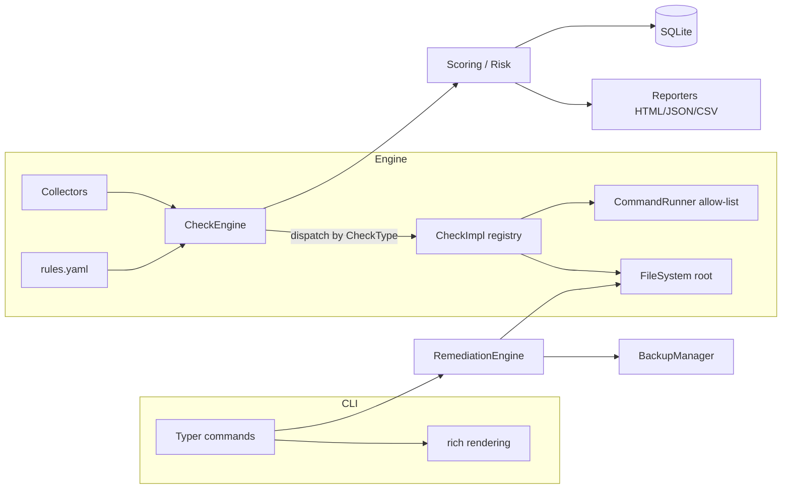

# Architecture

## Design goals

1. **Audit-only by default.** No code path modifies the host unless the operator explicitly runs `remediate` and confirms.
2. **Engine independent of the CLI.** The check engine, scoring, reporting and remediation are importable libraries; the CLI is a thin adapter.
3. **Rules as data.** Controls live in `checks/rules.yaml`. Adding a rule that reuses an existing check type is a YAML-only change.
4. **Deterministic & testable.** Every check reads through a *rooted* filesystem, so the same logic runs against a live host (`/`) or a generated fixture tree.
5. **Safe by construction.** Argument-vector subprocess only, an executable allow-list, path-traversal guards, and secret redaction in logs.

## Component overview

## The `CheckType` dispatch pattern

A rule declares a `check.type` (e.g. `sshd_config`, `sysctl`, `file_permissions`) and `params`. Each type has exactly one `CheckImpl` registered via a decorator. The engine looks up the implementation and calls `evaluate(rule, ctx) -> Finding`. This lets **83 rules share ~17 implementations**, keeping logic tested and reusable while the catalog stays declarative.

Implemented check types:

`sshd_config`, `file_permissions`, `sysctl`, `mount_option`, `login_defs`, `pwquality`, `pam_module`, `passwd_scan`, `service_status`, `package`, `firewall`, `sudoers`, `cron_permissions`, `world_writable`, `suid_sgid`, `kernel_module`, `auditd_rule`.

## The rooted filesystem

`app/utils/fs.py` exposes `FileSystem(root)`. It maps an absolute-looking system path (`/etc/ssh/sshd_config`) onto the configured root and refuses paths that escape it. Consequences:

- **Live audits** use root `/`.
- **Tests & demos** build a fixture tree (see `tests/fixture_builder.py`) with correct permissions at runtime and point the root at it — no root privileges, no host changes, and file *modes* are exact (git can't preserve them, so they're built fresh).
- **Runtime-only facts** (service state, firewall, packages) that can't be read from a static tree are supplied for fixtures via an optional `/run/cis-auditor-facts.json`, which never exists on a real host.

## Error handling

A check that raises is caught by the engine and surfaced as an `ERROR` finding (excluded from scoring) — one broken check never aborts the run. Unsupported distributions yield `NOT_APPLICABLE` rather than a false result.

## Data model

`Rule` (catalog) → evaluated into a `Finding` (status + evidence) → aggregated into an `AuditReport` (system info, `ScoreSummary`, `CategoryScore[]`, findings) → rendered and/or persisted.
